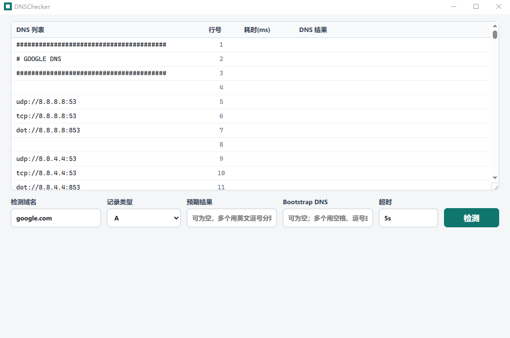
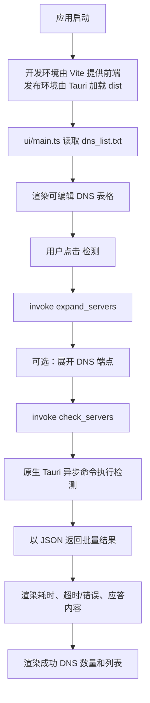
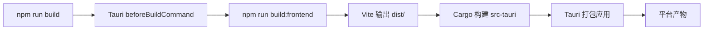

# DNSChecker

DNSChecker 是一个基于 Tauri 的桌面应用，用于批量检测 DNS 延迟和查询结果。

应用启动后会从 `dns_list.txt` 读取默认 DNS 列表，支持直接在表格中逐行编辑，并展示耗时、应答内容、超时/错误状态，以及筛选后的成功 DNS 列表。

## 截图



## 功能特性

- 从 `dns_list.txt` 批量检测 DNS 服务器
- 支持在表格中直接编辑 DNS 条目
- 统一设置检测域名、记录类型、预期结果、Bootstrap DNS 和超时时间
- 支持配置并发数，默认值为 `32`
- 结果表展示 `耗时(ms)` 和 DNS 应答内容
- 超时或其他失败会显示为 `timeout` / `error`，点击可复制完整错误信息
- 显示成功 DNS 列表以及 `success/total` 统计
- 支持通过 Tauri 打包 Windows、Linux 和 macOS 桌面应用

## 环境要求

- Node.js 24+
- npm 11+
- Rust stable 工具链
- Tauri 所需的平台构建依赖

Linux 额外需要 WebKitGTK 和打包依赖。GitHub Actions 工作流中安装的是：

```bash
sudo apt-get install -y libwebkit2gtk-4.1-dev libappindicator3-dev librsvg2-dev patchelf rpm
```

## 项目结构

```text
DNSChecker/
├─ .github/
│  ├─ workflows/
│  │  └─ tauri.yml          # CI：构建 debug/release Tauri 产物并上传
│  └─ dependabot.yml        # 依赖更新配置
├─ dns_list.txt             # 前端加载的默认 DNS 列表
├─ index.html               # Vite HTML 入口
├─ package.json             # npm 脚本及前端/Tauri CLI 依赖
├─ package-lock.json
├─ docs/
│  └─ screenshot.png        # 应用界面截图
├─ ui/
│  ├─ main.ts               # 前端状态、Tauri invoke 调用、结果渲染
│  └─ style.css             # 应用布局和表格样式
└─ src-tauri/
   ├─ Cargo.toml            # Rust/Tauri 依赖
   ├─ Cargo.lock
   ├─ build.rs
   ├─ tauri.conf.json       # Tauri 应用/构建/打包配置
   ├─ icons/
   │  └─ icon.ico
   └─ src/
      ├─ main.rs            # Tauri 二进制入口；隐藏 Windows 控制台窗口
      └─ lib.rs             # 暴露给前端的 Tauri 命令
```

`node_modules/`、`dist/` 和 `src-tauri/target/` 等生成目录默认会被忽略。

## DNS 列表格式

`dns_list.txt` 每行接受一个 DNS 服务器配置。

```text
8.8.8.8
1.1.1.1
dot://dns.google 8.8.8.8
https://dns.google/dns-query 8.8.8.8
```

第二列是可选项，用于为基于域名的 DNS 端点固定解析 IP。

支持的端点形式取决于原生命令实现，但当前 UI 设计面向以下格式：

- `udp://host[:port]`
- `tcp://host[:port]`
- `dot://host[:port]`
- `tls://host[:port]`
- `https://host/path`
- `doh://host/path`
- 裸 IP/host，默认按 UDP 处理

## 开发

安装依赖：

```bash
npm install
```

启动 Tauri 开发环境：

```bash
npm run dev
```

该命令会先启动 Vite：`http://127.0.0.1:5173`，随后拉起 Tauri 桌面窗口。

## 构建

仅构建前端：

```bash
npm run build:frontend
```

构建当前平台的桌面应用和安装包：

```bash
npm run build
```

在 Windows 上，典型输出如下：

```text
src-tauri/target/release/dnschecker.exe
src-tauri/target/release/bundle/msi/*.msi
src-tauri/target/release/bundle/nsis/*.exe
```

## 常用命令

```bash
npm run dev             # 启动 Vite + Tauri 开发环境
npm run build:frontend  # 构建 dist/ 前端资源
npm run build           # 构建 Tauri release 包
cd src-tauri && cargo check
```

## 运行流程



## 构建流程



## CI

GitHub Actions 工作流位于 `.github/workflows/tauri.yml`。

当前工作流会为以下平台构建 debug 和 release 产物：

- Windows：`x86`、`x64`、`arm`
- Linux：`x86`、`x64`、`arm`
- macOS：`arm`

上传的产物包括：

- Debug 可执行文件（Windows/Linux）
- Release 可执行文件（Windows/Linux）
- Tauri 生成的 Release 安装包或 bundle

对于 macOS，请下载打包后的 `.app` / `.dmg` 产物。未单独上传裸 Unix 可执行文件，因为从 Finder 双击时会打开 Terminal，而不是以应用包形式启动。

## Dependabot

`.github/dependabot.yml` 当前配置了以下更新源：

- `/` 下的 npm 依赖
- `/src-tauri` 下的 Cargo 依赖
- `/` 下的 GitHub Actions 依赖

## 说明

- Windows 二进制在 `src-tauri/src/main.rs` 中使用了 `windows_subsystem = "windows"`，因此双击运行不会弹出控制台窗口。
- 开发时执行 `npm run dev` 仍然需要终端，这个终端属于开发进程，不属于打包后的桌面应用。
- 默认并发数为 `32`。一般桌面环境建议维持在 `16-64` 区间，除非你明确知道需要更高并发。
