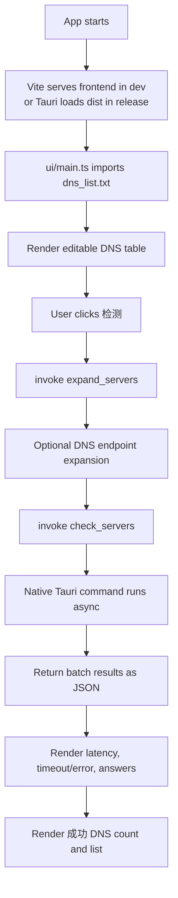
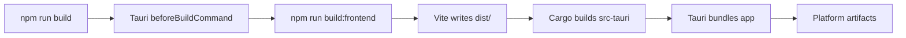

# DNSChecker

DNSChecker is a Tauri desktop app for checking DNS latency and query results in batches.

The UI loads the default DNS server list from `dns_list.txt`, lets each row be edited inline, and displays latency, answers, timeout/error status, and a filtered successful DNS list.

## Features

- Batch check DNS servers from `dns_list.txt`
- Inline editable DNS server table
- Shared domain, record type, expected answer, bootstrap DNS, and timeout settings
- Result table with `耗时(ms)` and DNS answers
- Timeout and other failures shown as `timeout` / `error`
- Successful DNS list with `success/total` count
- Tauri desktop packaging for Windows, Linux, and macOS

## Requirements

- Node.js 24+
- npm 11+
- Rust stable toolchain
- Platform build dependencies for Tauri

Linux additionally needs WebKitGTK and packaging dependencies. The GitHub Actions workflow installs:

```bash
sudo apt-get install -y libwebkit2gtk-4.1-dev libappindicator3-dev librsvg2-dev patchelf rpm
```

## Project Structure

```text
DNSChecker/
├─ .github/
│  ├─ workflows/
│  │  └─ tauri.yml          # CI: debug/release Tauri builds and artifacts
│  └─ dependabot.yml        # Dependency update configuration
├─ dns_list.txt             # Default DNS server list loaded by the frontend
├─ index.html               # Vite HTML entry
├─ package.json             # npm scripts and frontend/Tauri CLI dependencies
├─ package-lock.json
├─ ui/
│  ├─ main.ts               # Frontend state, Tauri invoke calls, result rendering
│  └─ style.css             # App layout and table styling
└─ src-tauri/
   ├─ Cargo.toml            # Rust/Tauri dependencies
   ├─ Cargo.lock
   ├─ build.rs
   ├─ tauri.conf.json       # Tauri app/build/bundle configuration
   ├─ icons/
   │  └─ icon.ico
   └─ src/
      ├─ main.rs            # Tauri binary entry; hides Windows console window
      └─ lib.rs             # Tauri commands exposed to the frontend
```

Generated folders such as `node_modules/`, `dist/`, and `src-tauri/target/` are ignored.

## DNS List Format

`dns_list.txt` accepts one DNS server per line.

```text
8.8.8.8
1.1.1.1
dot://dns.google 8.8.8.8
https://dns.google/dns-query 8.8.8.8
```

The optional second column pins the server IP used for a domain-based DNS endpoint.

Supported endpoint forms depend on the native command implementation, but the UI is designed for:

- `udp://host[:port]`
- `tcp://host[:port]`
- `dot://host[:port]`
- `tls://host[:port]`
- `https://host/path`
- `doh://host/path`
- bare IP/host, treated as UDP by default

## Development

Install dependencies:

```bash
npm install
```

Start the Tauri development app:

```bash
npm run dev
```

This starts Vite at `http://127.0.0.1:5173` and then launches the Tauri desktop window.

## Build

Build the frontend only:

```bash
npm run build:frontend
```

Build the desktop app and installers for the current platform:

```bash
npm run build
```

On Windows, typical outputs are:

```text
src-tauri/target/release/dnschecker.exe
src-tauri/target/release/bundle/msi/*.msi
src-tauri/target/release/bundle/nsis/*.exe
```

## Useful Commands

```bash
npm run dev             # Start Vite + Tauri dev app
npm run build:frontend  # Build dist/ frontend assets
npm run build           # Build Tauri release package
cd src-tauri && cargo check
```

## Runtime Flow



## Build Flow



## CI

GitHub Actions workflow: `.github/workflows/tauri.yml`.

The workflow builds debug and release artifacts for:

- Windows: `x86`, `x64`, `arm`
- Linux: `x86`, `x64`, `arm`
- macOS: `arm`

Uploaded artifacts include:

- Debug executable
- Release executable
- Release bundles/installers when generated by Tauri

## Dependabot

Dependabot is configured in `.github/dependabot.yml` for:

- npm dependencies in `/`
- Cargo dependencies in `/src-tauri`
- GitHub Actions dependencies in `/`

## Notes

- The Windows binary uses `windows_subsystem = "windows"` in `src-tauri/src/main.rs`, so double-clicking the app does not open a console window.
- `npm run dev` is still launched from a terminal during development; that terminal belongs to the dev process, not the packaged desktop app.
